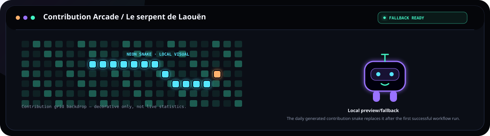
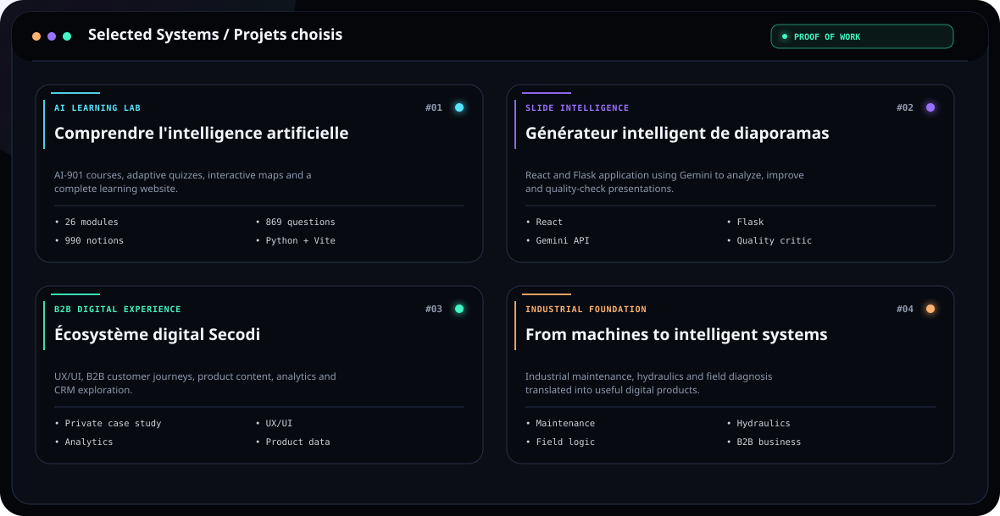

<picture>
  <source media="(prefers-color-scheme: dark)" srcset="assets/hero-dark.svg">
  <source media="(prefers-color-scheme: light)" srcset="assets/hero-light.svg">
  
</picture>

<picture>
  <source media="(prefers-color-scheme: dark)" srcset="assets/analytics-dark.svg">
  <source media="(prefers-color-scheme: light)" srcset="assets/analytics-light.svg">
  
</picture>

<picture>
  <source media="(prefers-color-scheme: dark)" srcset="https://raw.githubusercontent.com/LALA44599/LALA44599/output/dist/arcade-dark.svg">
  <source media="(prefers-color-scheme: light)" srcset="https://raw.githubusercontent.com/LALA44599/LALA44599/output/dist/arcade-light.svg">
  
</picture>

<picture>
  <source media="(prefers-color-scheme: dark)" srcset="assets/projects-dark.svg">
  <source media="(prefers-color-scheme: light)" srcset="assets/projects-light.svg">
  
</picture>

<picture>
  <source media="(prefers-color-scheme: dark)" srcset="assets/journey-dark.svg">
  <source media="(prefers-color-scheme: light)" srcset="assets/journey-light.svg">
  
</picture>

## Toolchain / Boîte à outils

| Development & IDE | Cloud & AI Platforms | Product & Creative |
|---|---|---|
| Python · JavaScript · TypeScript | Google Cloud · Firebase | Figma · WordPress |
| React · Vite · Flask | Microsoft Azure · Microsoft Foundry | Google Analytics · UX/UI |
| GitHub · VS Code · IDE workflows | Gemini API · ComfyUI | Remotion · PowerPoint automation |

## Connect / Échangeons

[GitHub](https://github.com/LALA44599) · [LinkedIn](https://fr.linkedin.com/in/laou%C3%ABn-bernard-901584212)

Private case study / Étude de cas privée: no internal code or data is published.
