<picture>
  <source media="(prefers-color-scheme: dark)" srcset="dark.svg">
  <source media="(prefers-color-scheme: light)" srcset="light.svg">
  
</picture>

## Hi, I'm LALA44599

I build modern web experiences with a focus on clean UI, automation, and AI-assisted workflows.

```txt
Focus    Web apps, UI engineering, automation, AI
Stack    React, Next.js, TypeScript, Node.js, Python
Tools    Docker, Git, Figma, Postgres, AWS
```

### Current Direction

- Building sharper full-stack projects
- Improving UI polish and developer experience
- Exploring AI-powered products and automations

### Connect

- GitHub: [@LALA44599](https://github.com/LALA44599)
- Portfolio: coming soon
