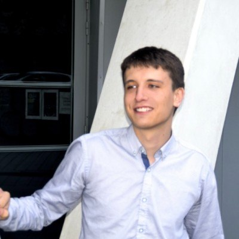

  

<h1 align="center">Laouën Bernard</h1>

  <strong>Chef de projet digital · Créateur de solutions IA</strong> 
  Digital Project Lead · AI Solutions Builder 
  Nantes, France · B2B · Automatisation · Learning systems

  <a href="https://fr.linkedin.com/in/laou%C3%ABn-bernard-901584212">LinkedIn</a>
  ·
  <a href="https://github.com/LALA44599">GitHub</a>

## Construire des outils qui servent vraiment

Je transforme des besoins métier concrets en expériences numériques utiles : apprentissage, automatisation, interfaces B2B et produits enrichis par l’IA.

I build useful digital systems at the intersection of business, industry and AI.

## Projets sélectionnés

### Comprendre l’intelligence artificielle

Une plateforme d’apprentissage autour de l’IA : **26 modules**, **869 questions** adaptatives et **990 notions** visualisées. Conçue avec Python et Vite.

### Générateur intelligent de diaporamas

Une application React et Flask qui analyse, améliore et contrôle la qualité de présentations grâce à Gemini.

### Expérience digitale B2B

UX/UI, parcours client, contenu produit, analytics et CRM pour un environnement B2B industriel.

> Private case study / Étude de cas privée — aucun code ou donnée interne n’est publié.

## Compétences

`Python` · `JavaScript` · `TypeScript` · `React` · `Vite` · `Flask` · `GitHub` · `VS Code`

`Google Cloud` · `Firebase` · `Microsoft Azure` · `Microsoft Foundry` · `Gemini API` · `ComfyUI`

`Figma` · `UX/UI` · `WordPress` · `Google Analytics` · `Remotion` · `PowerPoint automation`

## Parcours

**Industrie** → **Commerce technique B2B** → **Projets digitaux** → **Systèmes IA**

De la maintenance et du diagnostic terrain à la conception de produits numériques qui facilitent le travail des équipes.

## Activité GitHub

<picture>
  <source media="(prefers-color-scheme: dark)" srcset="https://raw.githubusercontent.com/LALA44599/LALA44599/output/dist/arcade-dark.svg">
  <source media="(prefers-color-scheme: light)" srcset="https://raw.githubusercontent.com/LALA44599/LALA44599/output/dist/arcade-light.svg">
  
</picture>
